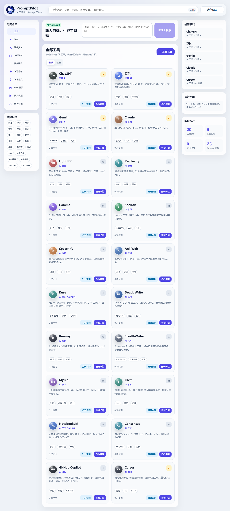
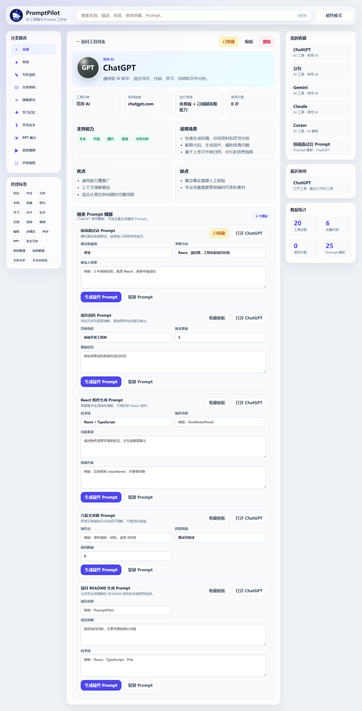
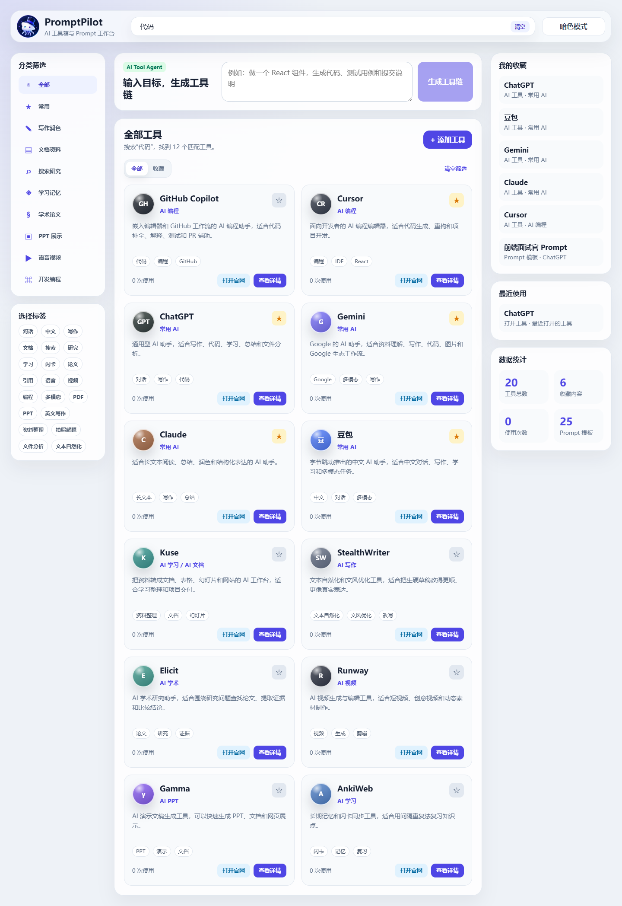
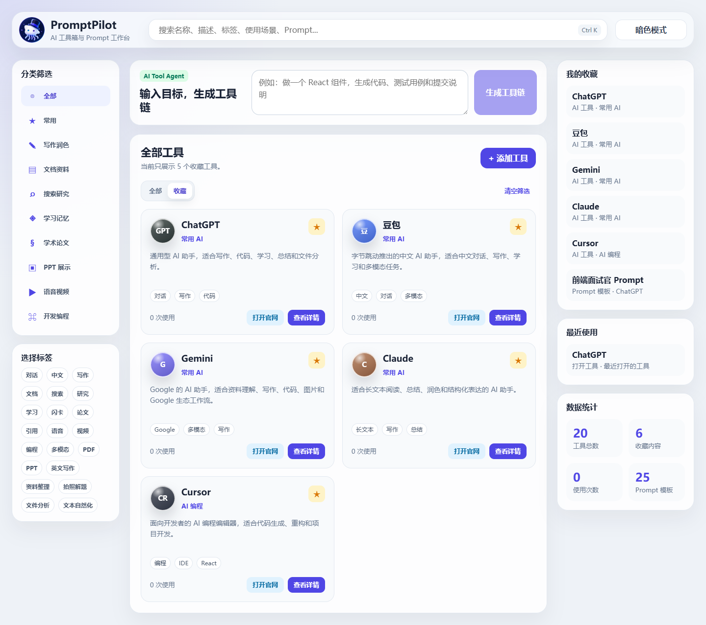

# PromptPilot

PromptPilot 是一个基于 React + TypeScript 开发的 AI 工具管理工作台，用来整理常用 AI 工具、Prompt 模板和任务工作流。用户可以按分类和标签查找工具，也可以收藏工具、Prompt 模板和 Agent 推荐的工作流。

## 项目亮点

- 基于 React + TypeScript 拆分工具卡片、详情页、分类侧边栏、右侧收藏栏和 Agent 输入区，页面结构清晰，组件职责明确。
- 实现工具收藏、Prompt 模板收藏、最近使用记录和新增工具，并通过 localStorage 做本地持久化，刷新后数据不会丢失。
- 优化搜索筛选体验，支持名称、描述、标签、使用场景、Prompt 模板内容匹配，并加入分类筛选、收藏筛选、防抖输入和空状态展示。

## 核心功能

- AI 工具管理：展示工具名称、分类、描述、标签、官网链接、定价信息和使用次数。
- 添加工具：通过弹窗录入工具名称、官网、分类、描述、标签和能力信息。
- 工具详情：支持编辑工具基础信息、复制 Prompt、打开官网和查看适用场景。
- 收藏功能：支持收藏 AI 工具、Prompt 模板和 Agent 生成的工作流。
- 最近使用：记录最近打开的工具、最近复制的 Prompt 和最近编辑的模板。
- 搜索筛选：支持多字段模糊匹配、分类筛选、标签筛选、收藏筛选和空状态提示。
- AI Tool Agent：输入任务目标后，自动推荐工具链、生成可复用 Prompt 和执行步骤。

## 项目截图

### 首页工作台



### 工具详情



### 搜索筛选



### 收藏列表



## 技术栈

- React
- TypeScript
- Vite
- CSS3 / 响应式布局
- localStorage 本地持久化

## 项目结构

```text
src
├─ app
│  └─ App.tsx
├─ assets
├─ features
│  └─ tools
│     ├─ components
│     ├─ data
│     ├─ hooks
│     ├─ store
│     └─ utils
├─ pages
│  └─ HomePage.tsx
└─ styles
   └─ global.css
```

## 本地运行

```bash
npm install
npm run dev
```

## 构建与检查

```bash
npm run lint
npm run build
```

## 可讲述的实现思路

1. 先用 `mockTools` 维护工具基础数据，再在页面层按分类、标签和搜索条件进行筛选。
2. 将收藏和最近使用抽到 `toolsStore` 中统一管理，并在每次状态变化后同步到 localStorage。
3. 搜索时对工具名称、描述、标签、能力、使用场景和 Prompt 模板做统一评分，最后按匹配度和使用次数排序。
4. Agent 输入区根据用户目标复用搜索逻辑，自动挑选工具链，并生成 Prompt 和执行步骤。

## 后续优化

- 接入真实 AI API，让 Agent 根据目标生成更准确的工具链和 Prompt。
- 增加 Prompt 模板的新增、编辑和删除功能。
- 增加登录和云端同步，让收藏和最近使用支持多设备共享。
